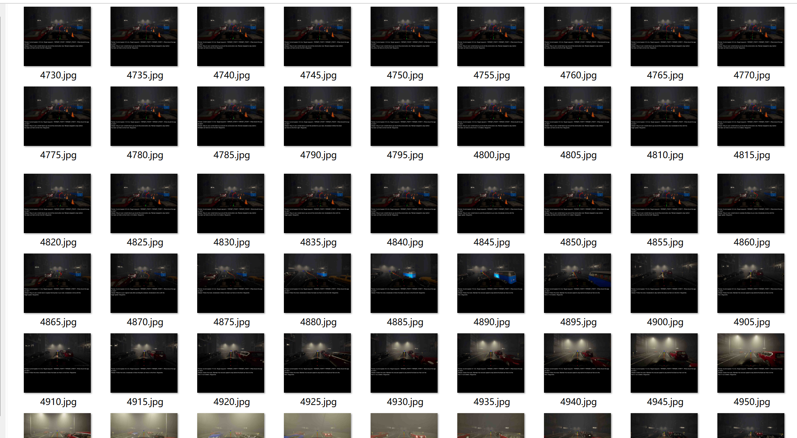
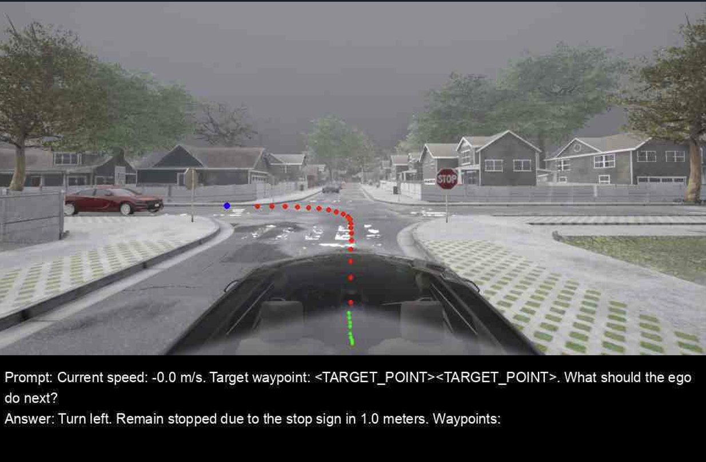

# simlingo 复现评测

## 写在前面

首先，这篇文章是2.0版本，因为1.0版本在我切双系统的时候损坏了。太气人了，点开文件夹发现文件都变成 0 byte 之后我直接下楼怒跑了三圈。以下是根据回忆重写的内容。

simlingo 已经开源了有一段时间了，所以这个评测来得稍微有些晚。我没有全部跑完 bench2drive 的 220 条路线，因为耗时间太长——CARLA 的时间限制在某些场景中很不严格，比如有些时候，自车撞到其他车辆之后静止几千帧场景才结束，造成大量的时间浪费（这也是 B2DVL 加时间限制设置的原因）。我实际上跑了 110 条，已经很能说明问题了。

先说结论，论文里的指标应该是没问题的，在 bench2drive 中确实能跑 80 分左右。这是一个非常高的分数，但是确实很让人感到诧异，因为 simlingo 的架构设计本身就不足以让它做出非常 reasonable 的推理链条：

1. 输入仅有前视，在超车等需要看侧后方摄像头的任务中，如何把握合适的时机？
2. 每次仅利用单帧信息，如何通过时序信息判断其他交通参与者的行为？

事实上，这两个架构上的缺陷带来的判断错误在评测中也是明显存在的，后文也会提到。在运行过程中，simlingo 大概占用 4GB 显存，CARLA 模拟速度 0.036x 左右（A6000）。它的 backbone 是 InternVL2-1B，在我的经验中，这么小参数的模型很难发挥出 reason 能力，所以我实在是很怀疑 simlingo 过拟合的程度，说不定改一改场景，比如 construction warning 换一个模型，分数就会是另一回事了？

还有一点有趣的，品鉴了这么多基于 VLM 或者 VLA 的方案之后，大多数还是要先生成自然语言的高级指令，再进行动作的生成。也就是说 reasoning 和 action 的部分是分开的。这不由得让我想起来 VLM 发展的时候，最早的 LLaVA 也是先将图像转化成为自然语言，然后再进行下游任务；不过后来大家发现这样会损失太多的信息，就逐渐去搞让图片和文字一样被 encode 的架构了。

那么现在 VLA 是不是在走 VLM 的老路呢？自然语言的中间状态是不是没有必要呢？我觉得还是难说的。因为 action 是经过一定的 reasoning 之后才可以得到的结果，如果不经过中间 reasoning 方面的监督直接获得 action 的话，难度还是颇高。再加上模态的问题：其实我一直觉得 VLA 是很抽象的存在，它的输入和输出其实是在一个“模态”里的：输入从真实世界坐标系中采集信息，经过一系列转换之后，又要从 language 返回到真实世界坐标系，本身信息损耗似乎就很大。就像是我们都玩过的传话游戏：一个人描述一张图片的内容之后，由第二个人画出来。这样的“重现”过程中，不管怎么说都会发生一系列的损耗。所以 action model 不可以作为纯粹的自然语言的下游，必须提供传感器信息来弥补中间的损失。也就是说势必不能全靠大模型串行地直接输出动作，要么使用能够利用到传感器信息的 action expert，要么想想其他什么方法。

这篇评测里我只列出 badcase 分析问题，并将它们打上 tag：

- `reasoning failure` 模型本来推理错了，导致动作更加错误
- `action failure` 模型推理对了，结果执行错了
- `overfit` 模型推理错了，却执行对了，假定为过拟合导致的

好，前面的部分就写到这里吧。

## 案例分析

### Accident_2534 `reasoning failure`

与车辆相撞 1 次，60 分

很典型的变道时机不对，架构设计仅看前视导致的必然结果。很好奇它的变道学习的是哪个特征，目标车道有车过去了就赶紧跟着变道？

### Accident_3307 `reasoning failure` + `action failure`

与车辆相撞 1 次，60 分

在图 2， 3， 4中，自然语言已经给出了 “停止” 或者 “减速” 的信息，但是车还是没有刹住，导致了追尾。图5， 6中，提到车辆应该跟随前方的 marron car / black car，而不是正前方的 green car，在推理方面也是出了问题。其实我本来对 simlingo 的 action 水平抱有较高期待，因为文章里提到用 dreaming 训练保证了 action model 会严格执行文字指出的指令，而不是过于依赖图片导致过拟合；现在我觉得虽然在路线选择上水平已经很高，但是在速度控制方面还是训练得不太好。我觉得这与仅用单帧图像训练使得模型对周围交通参与者运动情况估计不准也有关系。

reasoning 指出跟随错误的车辆的问题，我觉得和 1B 模型能力不高关系更大。至于某些后面会看见的 reasoning 错误的情况，可能与数据质量有关，遇到了再说。

### AccidentTwoWays_3410 `reasoning failure`

与车辆相撞 1 次，60 分

其实 simlingo 在包括 AccidentTwoWays 在内的对向变道场景中表现得都比较惊艳，我跑的 3 个 AccidentTwoWays 中，两个都是满分。可能是因为对象的车辆会出现在前视摄像头里，不如同向变道迷茫。

在这个场景中，我怀疑在变道的时候因为天色太暗，实在是没看清那辆蓝色的车。但是后来蓝色车迫近了却没有紧急停止也有些不应该。不过我认为这很可能是因为在数据集中，正在变道的时候都是“好”数据，也就是说专家数据中变道的时机都是正确的，导致学出来的效果是一旦开始变道就不会停止。这其实有利于动作连贯性，但是如果一开始时机就判断错了，基于错误的时机坚持变道，肯定就会像这样出事故。

### NonSignalizedJunctionRightTurn_2115 `reasoning failure`

与车辆相撞 1 次，60 分

这个看起来有些匪夷所思：蓝车一会儿看得见一会儿看不见，导致撞车。到后面更是一直认为前面有一个 black car，要加速才能跟随。这应该也是过拟合出的幻觉。

不过数据可能也有问题：如果 simlingo 用的是基于 DriveLM 的 vqa 生成且不做修改的话，那它对近处车辆的判断有些时候是有问题的，尤其是在路口或者车道变动时。诶我怎么知道呢，哈哈，说多了都是泪，，

但是数据再有问题，simlingo 过拟合也是不争的事实。在这种场景下做这种推理可以说是睁着眼说瞎话了，有些浪费掉训练很好的 action 部分。所以还是有必要加强 resoning 的能力（simlingo 用 1B 模型，做 reasoning 也是强人所难了）。

### ConstructionObstacle_2509 `action failure`

与车辆相撞 1 次，60 分

这个我反复确认了一下，在自然语言输出 Decelerate 的时候，确实没有观察到明显的减速。不过这个也有可能是 CARLA 里面制动的问题。在 CARLA 里，有些时候即使刹车踩到底，减速也不会很慢。所以这到底是不是 simlingo 模型本身的问题仍然存疑。

不过我对 simlingo 的速度控制也不是太抱希望。我怀疑它学习到的特征就是前车离远了加速离近了减速，虽然大多数情况下没错，但是可能有些时候还是不太安全。

### ConstructionObstacleTwoWays_1825 `reasoning failure`

撞击车辆 1 次并驶出车道，分数 48.3

没错这就是那种装上会静止几千帧、非常耗时的情况。因为变道时机不好撞上了迎面而来的深蓝色车，几千帧都是 remain stopped and stay behind the black (blue) car。有些时候有幻觉，判定没车应当加速；或者说前面是黄色车。这也是那种变道时机判断失误的 case。

### EnterActorFlow_11755 `reasoning failure`

撞击车辆 1 次，60 分

直接忽略了橙色车。事实上 simlingo 在路口的判定是比较灾难的，EnterActorFlow 场景无一满分。在路口中间的高质量决策数据应该也是不多的，过拟合又雪上加霜。

### MergerIntoSlowTraffic_2273 `reasoning failure`

撞击同一车辆 2 次，36 分

这是一个更典型的没有控制好速度的情况，证实了我的猜想：simlingo 在速度控制方面学习到的特征可能就是前车离远了加速离近了减速，但是当速度很快时，再按专家数据中的警戒距离减速就已经来不及了。

### OppositeVehicleTakingPriority_2143 `reasoning failure`

该条路径 100 分，但是问题不在这里。

对于只接收单帧信号的模型，遇到 stop sign，无从判断自己是否已经做过停止这个动作，就容易陷入无限等待。在这个场景中，自车在停止标志前停止了 800 帧，我也不知道它时基于什么标准最后变成了 turn left and accelerate to follow the maroon car。左转没错，但是红车是对向车辆，我们不可能 follow 它。所以 reasoning 还是有很多问题在的。

（_VanillaNonSignalizedTurnEncounterStopsign_3904 甚至等了 3500 帧！）

### SignalizedJunctionLeftTurn_4183 `reasoning failure`

撞击同一个车辆两次，36 分

查看自然语言指令，会发现 simlingo 直接把这辆橙色 cooper 当作空气一般忽略了。老生常谈的问题：DriveLM 脚本生成的路口数据质量很低，过拟合又使得问题更加严重——1B 模型基本不具备 reasoning 能力。

### YieldToEmergencyVehicle

全 Fail，情理之中。

## 惊艳之处

NonSignalizedLeftTurn 4 个场景，100 分两个，60 分一个且只是剐蹭：说明 simlingo 可以找到恰当的时机穿越车流，这可是我做专家模型时候遇到的难题之一。RightTurn 也基本都是通过或者剐蹭。我觉得 simlingo 确实抓到了能够通过的车流的某种特征，而且通过学习专家路径能让车开得更加自信，加速通过，缩短需要的窗口。效果还可以。对于没有设置必须穿越的车流的 VanillaNonSignalizedTurn 、VanillaNonSignalizedTurnEncounterStopsign 和 VanillaSignalizedTurnEncounterGreenLight，都拿到了全满分。VanillaSignalizedTurnEncounterRedLight 的情况中，交通灯太远加上停止线太早出现会导致闯红灯，不过这只是小遗憾。

（然而 SignalizedJunctionLeftTurn 的表现又想让我收回上面的话，在这个场景下穿越车流的时机把握得很差，1 满分 1 剐蹭一次 1 剐蹭两次 2 撞到静止直接超时）

ParkedObstacleTwoWays （全满分）以及很多 TwoWays 的场景都表现地不错。说明 simlingo 可以把握对向车道借道的时机，判断失误也往往在场景昏暗、难以识别来车的时候。

ParkingExit 两次场景全满分，不过按理来说 simlingo 应该看不到侧后方来车。纯粹的运气好？

没有撞到自行车和行人。不过对于视觉模型来说，判定这些还是太简单了。

## 总结

这块我不想写了，让 gpt 来写写：

> 整体来看，simlingo 在 bench2drive 的评测中确实交出了一个让人意外的高分答卷，说明它在某些典型场景中具备了比较稳健的决策和执行能力，尤其是在非信号路口穿越车流、双向借道、以及静态障碍物的处理上，展现出了一定的“自信”和连贯性。但与此同时，它的架构局限也非常明显：
>
> - **感知局限**：只有前视摄像头，导致在变道、并线等需要侧后方信息的场景中频繁出现事故；
> - **时序缺失**：只依赖单帧输入，无法判断交通参与者的动态，速度控制和连续动作都存在偏差；
> - **reasoning 能力不足**：1B 模型本身推理力有限，容易出现幻觉或“睁眼说瞎话”的现象；
> - **数据依赖严重**：在 DriveLM 生成数据质量不高的场景（尤其是路口）中，模型表现极差，甚至会过拟合到错误的规则；
> - **速度控制薄弱**：对“前车远了加速、近了减速”的依赖过强，一旦场景稍微复杂，就容易追尾或刹不住。
>
> 从这些 badcase 可以看出，simlingo 的高分更像是数据和环境约束下的一种“幸运拟合”，而不是一个具有强泛化能力的通用方案。换句话说，它确实能把 bench2drive 跑得很好，但换一换场景、规则或视觉特征，很可能立刻翻车。
>
> 所以我会把 simlingo 的价值总结为：**证明了 VLA 模型在自动驾驶场景中能跑出不错的 benchmark 分数，但离真正可靠的 reasoning 还很远**。未来如果想要提升，必须解决两个关键问题：
>
> 1. 引入多模态传感器信息，弥补纯前视和单帧的先天不足；
> 2. 加强 reasoning 部分的能力，减少过拟合和幻觉，保证动作逻辑的可解释性。

写得还可以。simlingo 的泛化确有问题，必须要有真正的 reasoning 能力，才能让自动驾驶系统越过 overfit 的 gap，做出更让人信服的可靠的判断。不过，回顾一些复现中出现的典型问题，例如速度控制不准，这些还需要数值上的精确控制来解决，对 action module 提出了把比较高的要求。